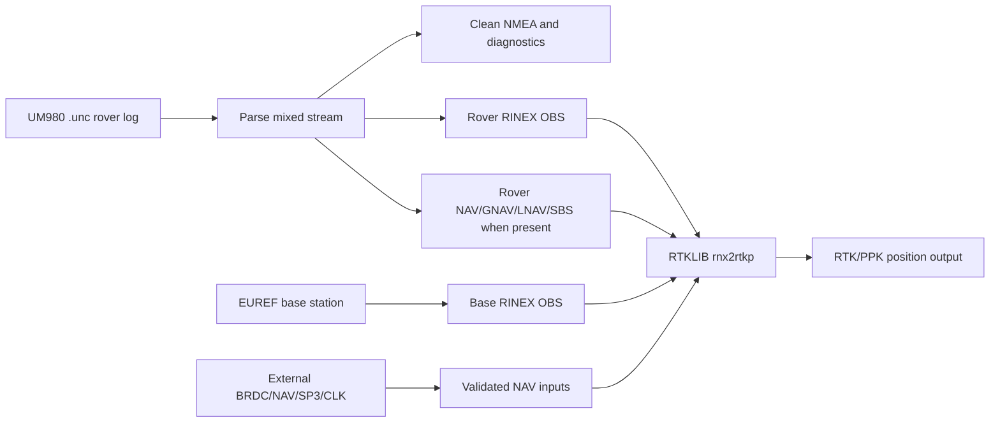

# UM980 RTKLIB Pipeline

Python tools for Unicore UM980 mixed serial logs and RTKLIB post-processing.

The CLI command is `um980-ppk`. It can generate UM980 logging scripts, analyse
mixed logs, extract clean NMEA and solution tracks, create observation CSV files,
write RINEX 3 observation scaffolds, resolve NAV inputs, and assemble safe
`rnx2rtkp` invocations.

This project intentionally does not depend on RTKLIB `convbin` for rover UM980
`.unc` conversion. Many RTKLIB builds do not include Unicore support, `convbin`
does not reliably handle UM980 ASCII mixed captures, and raw observations must
not be treated as navigation data.

## Why This Tool Exists

UM980 field logs are usually mixed serial captures: NMEA solution sentences,
Unicore ASCII/binary records, raw observations, and sometimes ephemeris records
are interleaved in one `.unc` stream. RTKLIB needs clean RINEX observation files,
valid navigation data, base-station observations, and platform-correct paths.
This tool performs that glue work explicitly so failed assumptions are visible:
unsupported UM980 records are reported, receiver ephemerides are written only
when real records can be converted, empty NAV placeholders are rejected, and
missing EUREF base products warn before fallback.



Typical workflow:

1. Generate a receiver init script for the UM980 logging mode you want.
2. Capture the rover `.unc` stream in the field.
3. Run `um980-ppk pipeline` to extract diagnostics and write rover RINEX OBS.
4. Use generated receiver NAV/GNAV/LNAV/SBS files when available, and add
   external NAV data when the rover log does not contain every needed system;
   either download EUREF base data or pass local base OBS files.
5. Let the pipeline run `rnx2rtkp`, or use `postprocess` when the RINEX inputs
   are prepared separately.

## Installation

The Python package requires Python 3.11 or newer. RTKLIB-ex tools are separate
binaries; install them under `~/RTKLIB-ex-bin/bin/`, pass `--rtklib-dir`, or keep
them on `PATH`.

For a system-wide installation, run from the repository checkout using the
system Python. On Linux this is typically:

```bash
sudo -H python3 -m pip install .
um980-ppk --help
```

On platforms without `sudo`, use the equivalent administrator/root shell, or the
active Python environment if it is already the system environment:

```bash
python3 -m pip install .
um980-ppk --help
```

Only install into a system-managed Python when that matches the machine's Python
packaging policy. To include optional YAML config support:

```bash
python3 -m pip install '.[config]'
```

For development and testing without a system-wide install, use a virtual
environment and an editable install:

```bash
python3 -m venv .venv
. .venv/bin/activate
python -m pip install -e '.[config,test]'
um980-ppk --help
pytest -q
```

For quick testing directly from a checkout without installing the package at all,
invoke the module with `PYTHONPATH=src`:

```bash
PYTHONPATH=src python -m um980_rtklib_pipeline.cli --help
PYTHONPATH=src python -m um980_rtklib_pipeline.cli rinex rover.unc --obs-csv -v
PYTHONPATH=src pytest -q
```

Pass `-v`/`--verbose` when processing real captures. Verbose mode reports
long-running parsing, solution extraction, observation decoding, RINEX writing,
base download, Hatanaka conversion, and RTKLIB execution stages so the CLI does
not sit silently while large `.unc` files are being processed. Pass `-d` or
`--debug` when debugging external tools; it includes verbose progress and logs
the exact shell-quoted `crx2rnx` and `rnx2rtkp` commands, wrapper path, and
stdout/stderr log paths before execution.

## Examples

Generate a receiver command script:

```bash
um980-ppk init generate \
  --port COM1 \
  --baud 230400 \
  --mode rover \
  --raw-format obsvmb \
  --raw-hz 2 \
  --nmea-preset solution-20hz \
  --solution-hz 20 \
  --debug-ascii-ephemeris \
  --ppp e6-has \
  --include-tropinfo \
  --ion gps,bds,bd3,gal \
  --save-config \
  --out um980-init.cmd \
  -v
```

For binary ephemeris captures, use the explicit binary command family:

```bash
um980-ppk init generate \
  --raw-format obsvmcmpb \
  --raw-hz 2 \
  --ephemeris every=300 \
  --ephemeris-format binary \
  --out um980-binary-ephem.cmd
```

For high-rate receiver-solution export plus RTKLIB raw observations, enable
BESTNAV explicitly. BESTNAV is a receiver solution product; it is useful for
NMEA tracks and diagnostics, but RTKLIB estimation still uses `OBSVMB` or
`OBSVMCMPB` plus ephemerides/NAV and base observations.

```bash
um980-ppk init generate \
  --port COM1 \
  --baud 230400 \
  --mode rover \
  --raw-format obsvmcmpb \
  --raw-hz 5 \
  --bestnav-format binary \
  --bestnav-hz 20 \
  --nmea-preset none \
  --ephemeris every=300 \
  --ephemeris-format binary \
  --include-ion \
  --include-utc \
  --diagnostic-format binary \
  --out um980-bestnav-rtklib.cmd
```

The generated receiver-side profile is equivalent to logging `BESTNAVB COM1
0.05`, `OBSVMCMPB COM1 0.2`, binary ephemerides every 300 seconds, and
`GPSIONB`/`BDSIONB`/`BD3IONB`/`GALIONB` plus
`GPSUTCB`/`BDSUTCB`/`BD3UTCB`/`GALUTCB` on change. Use
`--bestnav-format ascii --diagnostic-format ascii` for the ASCII alternative
(`BESTNAVA`, `GPSIONA`, `GPSUTCA`, and related `...A` families).

For an RTKLIB-ex `convbin -r unicore` trial, use a binary-only capture profile:
`OBSVMB`, binary ephemeris commands, and no NMEA or ASCII diagnostic messages on
the captured stream. See [UM980 Logging](docs/um980_logging.md#convbin-trial-capture)
for the UM890/UM980 init command and cleanup rules. `OBSVMCMPB` is not the first
convbin test path because the checked RTKLIB-ex Unicore decoder does not
dispatch compressed observation message ID 138.

When PPP is enabled, the init generator emits `CONFIG PPP TIMEOUT 120` and
`CONFIG PPP CONVERGE 15 30` unless overridden with `--ppp-timeout` and
`--ppp-converge horizontal,vertical`. `--include-tropinfo` is accepted only with
PPP enabled and emits one selected format as `ONCE` and `ONCHANGED`: `TROPINFOA`
by default, or `TROPINFOB` with `--diagnostic-format binary`. Ionosphere logging
can be enabled independently with `--ion gps,bds,bd3,gal` or `--include-ion`;
the generator emits the selected `...IONA`/`...IONB` command as `ONCHANGED`.
Add `--ion-period 300` to also repeat those messages periodically so sliced logs
still contain ionosphere parameters even if no receiver `ONCHANGED` event occurs
during the slice. UTC/time-system logging uses the matching options
`--utc gps,bds,bd3,gal`, `--include-utc`, and `--utc-period 300`, and follows
the same ASCII/binary diagnostic suffix selection.

Extract solution products and observations:

```bash
um980-ppk extract rover.unc -v --analysis-json --obs-csv --solution all
```

NMEA extraction writes:

- `<basename>.all.nmea`: every checksum-valid original NMEA sentence.
- `<basename>.position.nmea`: original position sentences only. By default,
  `--position-nmea best` keeps the best sentence per NMEA timestamp, preferring
  GGA/GNS over RMC because they carry fix quality or mode information. Fractional
  timestamps are preserved, so multi-Hz position streams keep every epoch.
- `<basename>.solution.nmea`: solution-track NMEA. For live NMEA-derived tracks
  this remains compact proprietary `PUM980Q` summaries; for BESTNAV-derived
  tracks it contains standard checksummed `GNGGA`, `GNRMC`, and `GNVTG`
  sentences at the native BESTNAV epoch rate.

Use `--position-nmea all` to keep every valid GGA/GNS/RMC position sentence, or
`--position-nmea none` to skip the compact original-position file.

Use internal UM980 BESTNAV receiver solutions as the normal solution track:

```bash
um980-ppk extract rover.unc \
  --track-source bestnavb \
  --solution all \
  --position-nmea none \
  -v
```

`--track-source auto` now falls back to decoded BESTNAV records when no valid
live NMEA position records are present. `--track-source bestnavb` forces binary
BESTNAVB only, while `--track-source bestnav` accepts decoded BESTNAVA and
BESTNAVB. BESTNAV is still a receiver solution product, not an RTKLIB raw input.

Generate standard app-readable NMEA from BESTNAV receiver-solution records:

```bash
um980-ppk extract rover.unc \
  --bestnav-nmea rover.bestnav-20hz.nmea \
  --bestnav-nmea-rate native \
  --bestnav-nmea-sentences GGA,RMC,VTG \
  -v
```

Downsample without interpolation by timestamp:

```bash
um980-ppk extract rover.unc \
  --bestnav-nmea rover.bestnav-5hz.nmea \
  --bestnav-nmea-rate 5 \
  --bestnav-nmea-sentences GGA,RMC,VTG \
  -v
```

Generated BESTNAV NMEA currently supports checksummed `GGA`, `RMC`, and `VTG`
with `GN` talker IDs by default; use `--bestnav-nmea-talk-id GP` for older
applications. The output is derived from decoded `BESTNAVA` or documented
message-ID 2118 `BESTNAVB` records and does not require live NMEA in the input
file.

Verbose extraction also prints message-family statistics for live NMEA,
BESTNAV, raw observations, ephemerides, ION, UTC, TROPINFO, malformed records,
and unsupported records. `--analysis-json` stores the same structured
`message_stats` plus preserved diagnostic payload fields. ION and UTC messages
are preserved as diagnostics for now; they are not written into RINEX NAV
headers until each family has a verified RTKLIB-compatible RINEX mapping.
TROPINFO is logged as receiver/PPP diagnostic information and is not passed to
`rnx2rtkp`.

Create rover RINEX observation output:

```bash
um980-ppk rinex rover.unc --obs-csv -v
```

Use `--rinex-compat convbin` when standalone `rinex` output should follow
RTKLIB `convbin` conventions more strictly. The integrated `pipeline` command
uses this RTKLIB-compatible profile by default. Both profiles suppress
non-standard unknown-system `U` satellites because RTKLIB rejects `U` in RINEX 3
OBS headers. The convbin profile additionally uses convbin-style observation
ordering and drops unsafe records such as observations logged before the
receiver reports a fine time solution.

Download base data URLs for a rover time window without fetching:

```bash
um980-ppk download-base rover.unc \
  --station CPAR \
  --rtklib-dir ~/RTKLIB-ex-bin/bin \
  --crx2rnx ./crx2rnx.exe \
  --offline -v
```

Run post-processing with explicit inputs:

```bash
um980-ppk postprocess rover.unc \
  --rover-obs rover.direct.obs \
  --base-obs CPAR.obs \
  --nav-file BRDC00WRD_R_20261380000_01D_MN.rnx \
  --base-station CPAR \
  --rnx2rtkp rnx2rtkp \
  --rtkconf rtkpost-normal.conf
```

`--rtkconf` is optional. When it is omitted, `postprocess` and `pipeline`
generate a conservative `rnx2rtkp` command-line profile instead of inventing a
missing config file: kinematic mode, L1/L2/L5, GPS+GLONASS+Galileo+BeiDou+QZSS,
10 degree elevation mask, and combined forward/backward post-processing. Adjust
that profile with `--rtk-pos-mode`, `--rtk-frequency`, `--navsys`,
`--rtk-navsys`, `--rtk-elevation-mask`, `--rtk-soltype`, `--rtk-ar-mode`, or
repeat `--rnx2rtkp-option=TOKEN` for raw RTKLIB options. Use `--rtkconf` when
you want a full RTKLIB-EX config such as one distributed with RTKLIB-EX.
`--output-format pos` uses the conventional `.pos` suffix for RTKLIB's default
latitude/longitude/height content, which RTKLIB config files call
`out-solformat=llh`. `--output-format nmea` passes RTKLIB's `-n` option,
equivalent to setting `out-solformat=nmea`; it does not merely rename a `.pos`
file to `.nmea`. Repeat `--output-format` or pass a comma-separated list, for
example `--output-format pos,nmea`, to create multiple solution products from
the same extracted rover/base/NAV inputs. The pipeline runs `rnx2rtkp` once per
requested format. If an RTKLIB build writes a successful run to stdout instead
of honoring `-o`, the pipeline saves that captured stdout as the requested
output file; if no output exists anywhere, the run fails with the command and
log paths.
For solution-quality debugging, add `--rtklib-stat-level 2` to write RTKLIB
`.stat` evidence. RTKLIB trace files can become very large, so trace generation
is opt-in through the quality-analysis modes described below rather than a
default raw pass-through.
In `-v` or `-d` mode, `postprocess` and `pipeline` also log rover/base RINEX
OBS capabilities before invoking RTKLIB. The summary lists advertised
constellations, frequency bands, and observation codes for the rover and the
aggregate base files. Extra base constellations or bands are logged as
available capability, not as a mismatch. Warnings are emitted only when the
base is missing a rover constellation or rover frequency band; `-d` additionally
shows per-base-file capabilities and exact missing observation codes.
When RTKLIB finishes successfully in `-v` or `-d` mode, the CLI prints a
solution-quality summary from the requested output file. The summary reports
epoch counts and percentages for each `Q=` value in standard `.pos`/`.llh`
output, plus cumulative time and track length for segments ending in that
quality. For NMEA output, the same summary uses GGA fix-quality fields and
labels them separately because NMEA quality codes are not the same as RTKLIB
`Q` values. Each quality line also shows the closest RTKLIB/GGA correspondence:
`Q=1` to GGA quality `4`, `Q=2` to GGA `5`, `Q=4` to GGA `2`, and `Q=5` to GGA
`1`.

## Bundled RTKLIB Configs

The repository includes several RTKLIB-ex configs for different operating
modes:

- `um980-onepass-gps-gal-bds-el28.conf`: default choice for a reasonably
  high-quality single-pass solution.
- `um980.conf`: reference UM980 configuration for multi-constellation,
  multi-frequency post-processing.
- `um980-autoqc-baseline.conf`: baseline only for explicit `--auto-sat-qc`
  two-pass runs. Do not use it as the normal one-pass config.
- `um980-onepass-best-current-debug.conf`: debugging profile only. It is meant
  for diagnostics and comparisons, not routine production processing.

Use `--rtkconf` with one of these configs when you want a full RTKLIB-EX
configuration. The generated command-line profile is mainly a portable
fallback. For explicit diagnostic two-pass satellite QC, use `--auto-sat-qc`
with `um980-autoqc-baseline.conf`. This runs pass 1 with RTKLIB `.stat`
residual output, writes `<stem>.autoqc.derived.conf` plus Markdown/JSON reports,
then runs pass 2 with the derived config. It is intentionally opt-in and never
runs by default.

Run the integrated pipeline with EUREF base download and RTKLIB execution:

```bash
um980-ppk pipeline rover.unc \
  --download-base \
  --station CPAR \
  --base-resolution high \
  --base-rinex-version 3 \
  --nav-file BRDC00WRD_R_20261380000_01D_MN.rnx \
  --rtkconf um980-onepass-gps-gal-bds-el28.conf \
  --run-rtklib
```

Two-pass satellite QC example:

```bash
um980-ppk pipeline rover.unc \
  --download-base \
  --station CPAR \
  --base-resolution high \
  --rtkconf um980-autoqc-baseline.conf \
  --auto-sat-qc \
  --run-rtklib
```

Use `--base-resolution low` for hourly 30 s EUREF data, normally RINEX 3 names
containing `01H_30S_MO`. Use `--base-resolution high` for generic BKG high-rate
archives, normally 15 minute 1 s RINEX 3 names containing `15M_01S_MO` or
`_01S_`. High-rate requests try BKG EUREF high-rate and BKG IGS high-rate
candidate groups before low-rate fallback. If high-rate data is requested but
unavailable, the command warns with the failed high-rate provider or candidate
URLs and falls back to low-rate data unless `--no-base-fallback` is set. Use
`--no-base-fallback` for experiments that compare high-rate and low-rate base
data, because any fallback makes the run a low-rate base run.
`--base-rinex-version 2` selects compact RINEX 2/Hatanaka EUREF names, including
BEV low-rate `.YYd.gz` names and BKG high-rate `.YYd.Z` names; `auto` plans
RINEX 3 first, then RINEX 2 alternatives.

Verbose logs always show the requested base resolution, candidate groups,
selected provider, selected nominal rate, fallback status, and selected file
names. If logs show `rate=30s`, `selected_rate=30s`, `_30S_`, or `01H_30S_MO`,
the run did not use high-rate base observations even if `--base-resolution high`
was passed.

Base downloads are cache-first. The downloader reuses existing archives,
decompressed files, or already converted `.rnx`/`.YYo` products in `--base-dir`
or `--cache-dir`, and downloads only missing planned products. Add
`--force-download` when you intentionally want to refresh the source archives.
When several base RINEX files are retained, the pipeline stages exactly those
files into `<basename>.rtklib-base/` and passes one wildcard argument to
`rnx2rtkp`. The wildcard is passed directly to RTKLIB, not expanded by the
shell, because RTKLIB expects the base station observation input as the second
positional argument. On Cygwin, the directory part is converted to a Windows
path while the `*` itself is preserved, because `cygpath` maps literal wildcard
characters to private-use Unicode code points.

Base download planning uses the recorded rover observation time span and
requests every hourly or 15 minute product that overlaps or touches that span.
High-rate archive planning adds a small internal 5 minute margin so the first
and last 15 minute chunks are not missed. `--time-margin SECONDS` deliberately
expands the rover span for all archive products; the default is `0` so adjacent
low-rate non-overlapping products are not fetched or passed to RTKLIB.

## Real-Time Base Recording

When no suitable high-rate archive exists for a station, record the base stream
before leaving and stop it after returning. The recorder uses RTKLIB `str2str`
as the NTRIP client and writes raw RTCM3 plus metadata; passwords are used only
in the subprocess URL and are redacted from logs and JSON.

```bash
um980-ppk record-base-rt \
  --caster HOST \
  --port 2101 \
  --mountpoint MOUNT \
  --user "$NTRIP_USER" \
  --password "$NTRIP_PASSWORD" \
  --out-dir base-recordings \
  --station CPAR \
  --rtklib-dir RTKLIB_EX_2.5.0 \
  -v
```

Leave the command running while mapping, then stop it with `Ctrl+C`. It prints
the `.rtcm3` path and writes `<mount>_<time>.meta.json` and
`<mount>_<time>.record.log` next to the raw stream.

Process the rover with that recorded base stream:

```bash
um980-ppk pipeline rover.ubx \
  --base-rtcm base-recordings/MOUNT_YYYYMMDDTHHMMSSZ.rtcm3 \
  --rtklib-dir RTKLIB_EX_2.5.0 \
  --run-rtklib \
  --nav-merge all \
  --rtkconf um980-onepass-gps-gal-bds-el28.conf
```

`--base-rtcm` and `--download-base` are mutually exclusive. The RTCM stream is
converted with RTKLIB `convbin -r rtcm3` into a base OBS/NAV pair and then fed
to the existing RTKLIB pipeline. If both converted base NAV and rover/downloaded
NAV are available, normal `--nav-merge` selection applies.

## Effective Run And NAV Diagnostics

Verbose pipeline/postprocess runs print one compact effective configuration
block near startup. It includes the selected station, base resolution and RINEX
version, NAV source/merge policy, RTKLIB config, output format, quality trace
mode, effective trace level, and whether generated `.stat` cleanup is enabled.
If a single-value option is specified more than once, argparse still uses the
last value, but `-v` warns explicitly:

```text
WARNING: option --nav-merge specified multiple times; using last value: all; previous values: best-per-system
```

With `-d`, the warning also includes argument positions. This is intended to
catch accidental command lines such as `--nav-merge best-per-system` followed
later by `--nav-merge all`.

NAV logs distinguish available broadcast ephemerides from receiver diagnostics.
`--nav-merge best-per-system` reports the deterministic source selected per
constellation, for example `GPS=base` because the preferred source has coverage
or `GAL=rover` because the base source is missing that system. `--nav-merge all`
states that all usable NAV inputs are passed and lists the contributing files.
ION/UTC families are reported as available or diagnostic-only unless they were
actually emitted into a supported RINEX NAV header; availability alone is not
reported as emission.

Verbose runs also create reproducibility artifacts by default unless disabled
with `--no-emit-run-script`:

- `<out_dir>/<basename>.rerun.sh`
- `<out_dir>/<basename>.commands.md`

The files are appended as commands become known, so they are still useful after
partial failures. They include the original high-level command, the exact
RTKLIB wrapper invocation, and the standalone quality-analysis command. Use
`--print-step-commands` to log copy-paste commands during the run, or
`--emit-run-script PATH` to choose a script path explicitly. `--dry-run-plan`
generates the plan and RTKLIB wrapper commands without running RTKLIB.

RTK2Go and other public casters are treated as generic NTRIP casters. To inspect
a caster without adding RTK2Go-specific assumptions:

```bash
um980-ppk ntrip-sourcetable \
  --caster rtk2go.com \
  --port 2101 \
  --out rtk2go-sourcetable.txt \
  --contains CPAR
```

The tool does not guarantee mountpoint quality. Before relying on a stream,
verify the base coordinates, distance to the rover route, RTCM 1005/1006
presence, multi-GNSS MSM content, receiver/antenna metadata where available,
and converted RINEX observation types.

## Base Advisory

Use `base-candidates` as a non-destructive first check before picking a base
station. It uses live NMEA or BESTNAV-derived rover solution points to estimate
the representative rover position and ranks known EUREF/EPN candidates without
running RTKLIB or downloading large observation files.

```bash
um980-ppk base-candidates rover.ubx \
  --track-source bestnav \
  --stations CPAR,TUBO \
  --radius-km 150 \
  --base-resolution high \
  --station-catalog-source curated \
  --format markdown \
  --analysis-json \
  -v
```

By default, the command uses a cache-first EPN station catalogue. Use
`--refresh-station-catalog --station-catalog-source epn-latest` to refresh the
cache from the official EPN SSC coordinate files, or
`--station-catalog-source curated` for fully offline CPAR/TUBO-style testing.
The JSON output includes the coordinate source and frame so runs are
reproducible. If catalogue refresh fails, the command falls back to a fresh
cache or curated stations and reports the reason.

Add `--probe-archives` to make lightweight archive availability checks for the
selected span. The probe uses planned EUREF/BKG URLs and HTTP `HEAD` where
possible; it does not download full observation bodies. `--download-headers-only`
is accepted for the probe contract, but compressed RINEX header-range parsing is
not implemented yet, so constellation/frequency header summaries remain
`unknown` unless supplied by future cached probe data. High-rate and low-rate
status are reported separately, and low-rate fallback is only advisory; normal
pipeline base selection is not changed by this command.

## Optimizer Dry Run

Use `optimize-settings --dry-run` to plan a bounded comparison of RTKLIB
configs, bases, NAV/SBAS/ION modes, and representative time samples before
spending time on full processing. The command defaults to dry-run planning; use
`--execute` to run the bounded plan through the existing `pipeline` command.
Every run gets its own output directory, exact command, stdout/stderr logs and,
when RTKLIB creates a parseable solution, compact metrics.
It can also consume `base-candidates` JSON with
`--base-candidates-json candidates.json --top-bases 3`.

```bash
um980-ppk optimize-settings rover.ubx \
  --config um980-onepass-gps-gal-bds-el28.conf \
  --bases TUBO,CPAR \
  --base-resolution auto \
  --nav-source auto-prefer-base \
  --sbas-source auto \
  --emit-ion-utc off \
  --start-time 2026-05-30T05:00:00Z \
  --end-time 2026-05-30T05:30:00Z \
  --sample-count 4 \
  --sample-duration 120s \
  --max-variants 6 \
  --max-runs 24 \
  --dry-run \
  --format markdown
```

Without an explicit time window, dry-run samples are placeholders because the
baseline solution has not been classified yet. Keep `--max-variants` and
`--max-runs` small for field comparisons; the goal is to avoid uncontrolled
combinatorial processing.

Tiny bounded execution example:

```bash
um980-ppk optimize-settings rover.ubx \
  --config um980-onepass-gps-gal-bds-el28.conf \
  --bases TUBO,CPAR \
  --base-resolution auto \
  --start-time 2026-05-30T05:00:00Z \
  --end-time 2026-05-30T05:04:00Z \
  --sample-count 1 \
  --sample-duration 120s \
  --max-variants 2 \
  --max-runs 2 \
  --execute \
  --out-dir optimizer-out \
  --format markdown
```

The execution backend is intentionally conservative: it invokes this package's
own `pipeline` CLI per sample/variant, stores `optimizer-results.json`, and
continues recording failed variants instead of claiming success. It does not
mutate arbitrary RTKLIB options or run high RTKLIB trace unless the underlying
pipeline command is extended to do so.

## RTK Quality Analysis

Use `quality` to inspect a generated RTKLIB `.nmea`, `.pos`, or `.llh`
solution together with an optional `.stat` file. The analyser keeps raw RTK
state summaries separate from QC confidence. Raw fixed/float/DGPS/single
percentages are reported unchanged, while fixed epochs are additionally
classified as supported, provisional, suspect, or unknown based on local
evidence. Suspect fixed is heuristic evidence, not proof of a false fix.
Residuals or slip flags are used as hard evidence only when they can be
time-aligned and deduplicated against solution epochs; otherwise fixed
confidence is reported as unknown/limited instead of forcing all fixed time to
suspect.

Raw fixed percentage, median fixed segment length, global residual p95/p99,
raw slip flags, and observation rejection totals are diagnostic context, not
quality headlines. Aggressive filtering can make those values look cleaner
while producing worse fixed trajectory islands. The report therefore includes
track-plausibility metrics: horizontal step, speed, acceleration, jerk, heading
and yaw-rate summaries by quality state; fixed internal jumps; stationary fixed
jumps; fixed-island cross-track offsets; stop drift/chatter; long stable fixed
coverage; geometry-cost context; and trace-aligned AR/slip/rejection/residual
evidence. Long smooth fixed segments are reported separately from short chattery
fixed islands.

```bash
PYTHONPATH=src python -m um980_rtklib_pipeline.cli quality \
  --solution rover_20260531095025-base-rtk.nmea \
  --stat rover_20260531095025-base-rtk.nmea.stat \
  --out-md rover_20260531095025-quality.md \
  --out-json rover_20260531095025-quality.json
```

The older standalone subcommand name `quality-analyze` is kept as a deprecated
compatibility alias. The pipeline flag remains `--quality-analyze`.

Large `.stat` files are parsed as a single streaming pass. Slip evidence is
deduplicated and unique STAT epochs are aligned to solution epochs through an
indexed lookup rather than a linear scan. The JSON `performance` block reports
`stat_parse_elapsed_s`, `stat_lines_read`, `sat_lines_parsed`,
`raw_slip_flags`, `dedup_slip_events`, and `unique_slip_epochs`.

Optional bounds are available for quick inspection:

```bash
--quality-stat-max-lines 200000
--quality-stat-max-seconds 10
--quality-fast
```

If parsing is capped or `--quality-fast` skips STAT detail, the report marks
QC confidence as limited/unknown where residual or slip evidence is incomplete.

Two quality JSON reports can be compared directly:

```bash
PYTHONPATH=src python -m um980_rtklib_pipeline.cli quality \
  --compare-json baseline.quality.json snr35.quality.json \
  --format markdown
```

The comparison reports deltas for fixed coverage, long fixed coverage,
residuals, rejection/slip cleanliness, and track plausibility. If filtering
reduces noisy observations but worsens trajectory consistency, the report warns
that this should not be treated as a quality improvement.

Distance and time are both reported because they answer different questions.
Time-based segment length is always relevant. Distance-based segment length is
mainly useful while moving; a long stationary fixed segment can have near-zero
distance and still be valid, so the analyser does not mark low-distance fixed
segments suspect unless median speed exceeds the stationary threshold.

Motion-aware checks use an inferred profile by default and can be overridden:

```bash
--quality-motion-profile highway
--quality-max-speed-mps 60
--quality-transition-window-s 2
```

This keeps normal highway motion, such as 7-8 m between 5 Hz epochs at about
130 km/h, from being treated as a transition jump. Bridge-like
fixed-to-float/missing-to-fixed patterns are reported as dropout/reacquisition
events unless the local dynamics or time-aligned diagnostics are implausible.
The JSON and Markdown reports also include route-distance bins by default
(`--quality-route-bin-km 10`, or `--quality-no-route-bins`). Baseline bins are
reported when base coordinates are available; growing baseline distance is
context for expected ambiguity-resolution degradation, not by itself suspect
evidence.

Standalone quality analysis can receive base coordinates explicitly:

```bash
--base-llh 50.1234 14.1234 300.0
--base-ecef 3970000.0 1050000.0 4860000.0
```

Optimise processing on QC-supported fixed time/distance and missing/no-output time,
not raw fixed percentage alone. Some RTKLIB settings can look better by simply
suppressing bad epochs; the report therefore estimates expected epoch interval,
missing epochs, missing time, longest output gap, and quality percentages both
over elapsed time and emitted time.

The integrated pipeline can run the same analysis after RTKLIB finishes:

```bash
PYTHONPATH=src python -m um980_rtklib_pipeline.cli pipeline rover.ubx \
  --download-base \
  --station CPAR \
  --rtkconf um980-onepass-gps-gal-bds-el28.conf \
  --run-rtklib \
  --quality-analyze
```

If the `.stat` file is missing, the analyser still writes solution and segment
metrics and warns that residual, slip, and rejection evidence is unavailable.

### Optional RTKLIB Trace Diagnostics

Trace diagnostics are optional because RTKLIB trace files can be very large.
Use temporary mode for normal aggregate diagnostics:

```bash
PYTHONPATH=src python -m um980_rtklib_pipeline.cli pipeline rover.ubx \
  --run-rtklib \
  --quality-analyze \
  --quality-trace temporary
```

This runs `rnx2rtkp` with trace level 3 in an isolated temporary directory.
RTKLIB commonly writes the main trace next to the solution as
`<solution-output>.trace`; the pipeline prefers that real solution trace over
small temporary-cwd artifacts, streams aggregate diagnostics into the quality
JSON/Markdown report, records the parsed path and raw bytes read, and then
deletes the generated trace when temporary cleanup is enabled. Use level 2 for a
smaller trace:

```bash
--quality-trace temporary --rtklib-trace-level 2
```

Trace parsing is streaming and reads the full trace by default before cleanup.
Use `--quality-trace-max-bytes N` only when you intentionally want to cap trace
analysis; the JSON then records `trace_truncated=true`. Level 4 and above can
create very large files, so use them only for manual debugging.

When timestamps are recognised in trace lines, trace events are aligned to
solution epochs using `--quality-trace-align-tolerance-s` (default `0.5`).
RTKLIB trace lines that contain only a time-of-day, such as
`2 05:10:30.40: ambiguity validation failed (...)`, are anchored to the
solution date during quality analysis, with day rollover handled against nearby
solution epochs.
Only time-aligned trace evidence can contribute local QC reasons such as
`trace_low_ar_ratio`, `trace_ambiguity_validation_failed`,
`trace_recent_slip`, or `trace_residual_outlier`; global trace counters are
diagnostic only.

Use keep mode only for manual debugging:

```bash
--quality-trace keep --rtklib-trace-file rnx2rtkp.trace
```

Trace level 0 is rejected for trace generation. Existing traces can be analysed
without rerunning RTKLIB, and explicit `--trace PATH` is retained by default:

```bash
PYTHONPATH=src python -m um980_rtklib_pipeline.cli quality \
  --solution rover-rtk.pos \
  --trace rnx2rtkp.trace \
  --out-json rover-rtk.quality.json
```

### Optional `.stat` Cleanup

By default, RTKLIB `.stat` files are kept. To delete `.stat` files generated by
the current pipeline/postprocess run after quality statistics have been
extracted and written:

```bash
--quality-analyze --quality-clean-stat
```

`--quality-stat-cleanup` is accepted as the same opt-in flag.

Standalone `quality --stat existing.stat --quality-clean-stat` is
refused so archived user-supplied `.stat` files are not deleted accidentally.
Cleanup status is recorded in the quality JSON and Markdown report.

### Baseline And Route Quality Bins

When base coordinates are available, the quality JSON includes
`baseline_summary.quality_by_baseline_bin` for the default bins
`0,10,20,30,40,50,75,100,150` km. Each bin reports elapsed/emitted/missing
time, travelled distance, raw quality time and distance percentages, fixed
segment duration statistics, QC confidence totals, and aligned STAT/trace
evidence counts. The Markdown report renders a compact
`Quality By Base-Rover Distance` table and omits empty bins by default; use
`--quality-md-show-empty-baseline-bins` to include them. Route-distance bins
expose the same core metrics through `route_bins`.

### Reproducible Pipeline Steps

Verbose pipeline runs write `<basename>.pipeline-manifest.json` alongside the
rerun shell script and command Markdown. The manifest records planned and
completed steps, inputs, outputs, dependencies, elapsed time, and whether an
output was reused. The current safe step boundaries are:

```text
extract_receiver_products, write_rinex_obs, resolve_base, run_rtklib, quality
```

Use `--dry-run-plan` to write the manifest without parsing the rover or running
RTKLIB. Use `--from-step STEP`, `--only-step STEP`, `--skip-existing`, and
`--force-step STEP` to reuse existing products at those command boundaries.

### UM980 Stream Parser API

For tools that need parser-level diagnostics without running the full pipeline,
use the documented facade:

```python
from pathlib import Path
from um980_rtklib_pipeline.um980_stream import parse_file

result = parse_file(Path("rover.ubx"))
print(result.diagnostics.as_dict())
```

The public API exposes `parse_bytes`, `parse_file`, `iter_records`,
`summarize_records`, `ParseResult`, parser warning/error shapes, and a
Unicore A/B-suffix message registry. Command responses such as
`$command,...,response: OK*XX` are classified separately from live NMEA.

`postprocess` passes a base reference position to RTKLIB when one is available.
Use `--base-ecef X Y Z` or `--base-llh LAT LON HEIGHT` for an explicit
position. Otherwise `--base-station CPAR` resolves current EPN/EUREF ETRF2000
ECEF coordinates and emits `-r X Y Z`; auto mode falls back to the base RINEX
`APPROX POSITION XYZ` header.

On Cygwin, Windows RTKLIB tools usually need Windows-style paths for input
files even though the Python pipeline sees Unix paths. `postprocess`
auto-detects Cygwin plus Windows `.exe` or PE binaries, including PE binaries
without an `.exe` suffix, and passes Windows paths to RTKLIB while still
validating local files with Unix paths:

```bash
um980-ppk postprocess rover.unc \
  --rover-obs /cygdrive/c/ppk/rover.direct.obs \
  --base-obs /cygdrive/c/ppk/CPAR.obs \
  --nav-file /cygdrive/c/ppk/BRDC00WRD_R_20261400000_01D_MN.rnx \
  --rtklib-dir /cygdrive/c/RTKLIB/bin \
  --rnx2rtkp rnx2rtkp.exe \
  --rtkconf /cygdrive/c/ppk/rtkpost-normal.conf
```

Use `--rtklib-path-style unix` for a native Cygwin/Linux RTKLIB build, or
`--rtklib-path-style windows` to force Windows argument paths.

RTKLIB tools are resolved in this order:

1. explicit tool path from `--rnx2rtkp`;
2. `--rtklib-dir` plus the tool name;
3. user-local `~/RTKLIB-ex-bin/bin/`;
4. repo-local `build-tools/RTKLIB-ex-bin/bin/`;
5. system `PATH`.

For Hatanaka base observations, `crx2rnx` is resolved separately from
`--crx2rnx`, `--rtklib-dir`, the current directory, user-local/repo-local
RTKLIB-ex installs, and `PATH`. Explicit local paths such as
`--crx2rnx ./crx2rnx` are resolved before `--rtklib-dir`; on Cygwin the matching
`.exe` sibling is also considered.

The `build-tools/RTKLIB-ex-bin/` directory is intentionally ignored by git. It
is a convenient local install location for manually built RTKLIB-ex binaries.
On Android/Termux shared storage, files in this directory may not be directly
executable; the pipeline mirrors the selected local tool into Termux-private
temporary storage before launching it. This mirroring is Termux-only; Cygwin
keeps the selected RTKLIB executable path and never rewrites it to a Termux
`/data/data/...` location.

For Android/Termux, `~/RTKLIB-ex-bin/bin/` is preferred because binaries stored
under `$HOME` can be executed directly.

## Current Limitations

- `OBSVMA` ASCII observation decoding supports a conservative token-based subset.
- `OBSVMB` and `OBSVMCMPB` binary observation payloads are decoded in Python.
- RINEX output from real UM980 observation payloads decodes the documented
  tracking-status constellation and signal bits for common GPS, GLONASS,
  Galileo, BDS, QZSS, SBAS, and IRNSS observations. Unknown signal types are
  still warned and written with conservative fallback codes.
- Rover ASCII ephemeris extraction writes non-empty `.nav`, `.gnav`, `.lnav`,
  `.cnav`, and `.sbs` files for convertible `GPSEPHA`, `GLOEPHA`, `GALEPHA`,
  `BDSEPHA`, and RTKLIB-shaped SBAS message records. Missing systems,
  malformed records, and unsupported BDS-3/QZSS/binary ephemeris records are
  logged and included in analysis
  JSON instead of producing placeholder files.
- `--debug-ascii-ephemeris` adds `GPSEPHA`, `GLOEPHA`, `GALEPHA`, `BDSEPHA`,
  `BD3EPHA`, and `QZSSEPHA` every 300 seconds. The generated script warns that
  this creates large debug logs and includes the ephemeris contribution in the
  serial-line utilisation estimate. The estimate accounts for one ephemeris
  record per expected satellite, not just one line per constellation.
- `--ephemeris-format binary` emits `GPSEPHB`, `GLOEPHB`, `GALEPHB`,
  `BDSEPHB`, `BD3EPHB`, and `QZSSEPHB`. The shorter names without `B` are not
  valid UM980 commands and are expected to be rejected by the receiver.
- Network download code is explicit and opt-in. Offline mode prints planned URLs.
- `pipeline` executes RTKLIB when `--run-rtklib`, `--rtkconf`, usable NAV data
  from receiver or explicit inputs, and base observations from `--base-obs` or
  `--download-base` are supplied. Without those inputs it stops after
  extraction/RINEX generation and logs a warning.
- RTKLIB commands are assembled with argument lists, and generated shell wrappers
  are for reproducibility only.
