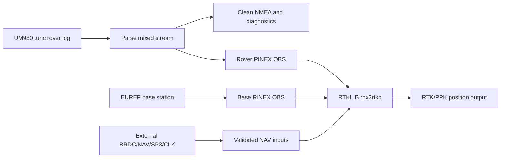

# UM980 RTKLIB Pipeline

Python tools for Unicore UM980 mixed serial logs and RTKLIB post-processing.

The CLI command is `um980-ppk`. It can generate UM980 logging scripts, analyse
mixed logs, extract clean NMEA and solution tracks, create observation CSV files,
write RINEX 3 observation scaffolds, resolve NAV inputs, and assemble safe
`rnx2rtkp` invocations.

This project intentionally does not depend on RTKLIB `convbin` for rover UM980
`.unc` conversion. Many RTKLIB builds do not include Unicore support, and raw
observations must not be treated as navigation data.

## Why This Tool Exists

UM980 field logs are usually mixed serial captures: NMEA solution sentences,
Unicore ASCII/binary records, raw observations, and sometimes ephemeris records
are interleaved in one `.unc` stream. RTKLIB needs clean RINEX observation files,
valid navigation data, base-station observations, and platform-correct paths.
This tool performs that glue work explicitly so failed assumptions are visible:
unsupported UM980 records are reported, empty NAV placeholders are rejected, and
missing EUREF base products warn before fallback.



Typical workflow:

1. Generate a receiver init script for the UM980 logging mode you want.
2. Capture the rover `.unc` stream in the field.
3. Run `um980-ppk pipeline` to extract diagnostics and write rover RINEX OBS.
4. Provide external NAV data and either download EUREF base data or pass local
   base OBS files.
5. Let the pipeline run `rnx2rtkp`, or use `postprocess` when the RINEX inputs
   are prepared separately.

## Examples

Generate a receiver command script:

```bash
um980-ppk init generate \
  --port COM1 \
  --baud 230400 \
  --mode rover \
  --raw-format obsvmb \
  --raw-hz 2 \
  --nmea-preset solution-20hz \
  --ephemeris every=300 \
  --ppp e6-has \
  --save-config \
  --out um980-init.cmd \
  -v
```

Extract solution products and observations:

```bash
um980-ppk extract rover.unc -v --analysis-json --obs-csv --solution all
```

Create rover RINEX observation output:

```bash
um980-ppk rinex rover.unc --obs-csv -v
```

Download base data URLs for a rover time window without fetching:

```bash
um980-ppk download-base rover.unc --station CPAR --offline -v
```

Run post-processing with explicit inputs:

```bash
um980-ppk postprocess rover.unc \
  --rover-obs rover.direct.obs \
  --base-obs CPAR.obs \
  --nav-file BRDC00WRD_R_20261380000_01D_MN.rnx \
  --base-station CPAR \
  --rnx2rtkp rnx2rtkp \
  --rtkconf rtkpost-normal.conf
```

Run the integrated pipeline with EUREF base download and RTKLIB execution:

```bash
um980-ppk pipeline rover.unc \
  --download-base \
  --station CPAR \
  --base-resolution high \
  --base-rinex-version 3 \
  --nav-file BRDC00WRD_R_20261380000_01D_MN.rnx \
  --rtkconf rtkpost-normal.conf \
  --run-rtklib
```

Use `--base-resolution low` for hourly 30 s EUREF data or
`--base-resolution high` for 15 minute 1 s high-rate files. If high-rate data is
requested but unavailable, the command warns with the failed URLs and falls back
to low-rate data unless `--no-base-fallback` is set. `--base-rinex-version 2`
selects compact RINEX 2/Hatanaka EUREF names, including BEV low-rate
`.YYd.gz` names and BKG high-rate `.YYd.Z` names; `auto` plans RINEX 3 first,
then RINEX 2 alternatives.

`postprocess` passes a base reference position to RTKLIB when one is available.
Use `--base-ecef X Y Z` or `--base-llh LAT LON HEIGHT` for an explicit
position. Otherwise `--base-station CPAR` resolves current EPN/EUREF ETRF2000
ECEF coordinates and emits `-r X Y Z`; auto mode falls back to the base RINEX
`APPROX POSITION XYZ` header.

On Cygwin, Windows RTKLIB `.exe` tools usually need Windows-style paths for
input files even though the Python pipeline sees Unix paths. `postprocess`
auto-detects Cygwin plus `.exe` and passes Windows paths to RTKLIB while still
validating local files with Unix paths:

```bash
um980-ppk postprocess rover.unc \
  --rover-obs /cygdrive/c/ppk/rover.direct.obs \
  --base-obs /cygdrive/c/ppk/CPAR.obs \
  --nav-file /cygdrive/c/ppk/BRDC00WRD_R_20261400000_01D_MN.rnx \
  --rtklib-dir /cygdrive/c/RTKLIB/bin \
  --rnx2rtkp rnx2rtkp.exe \
  --rtkconf /cygdrive/c/ppk/rtkpost-normal.conf
```

Use `--rtklib-path-style unix` for a native Cygwin/Linux RTKLIB build, or
`--rtklib-path-style windows` to force Windows argument paths.

RTKLIB tools are resolved in this order:

1. explicit tool path from `--rnx2rtkp`;
2. `--rtklib-dir` plus the tool name;
3. user-local `~/RTKLIB-ex-bin/bin/`;
4. repo-local `build-tools/RTKLIB-ex-bin/bin/`;
5. system `PATH`.

The `build-tools/RTKLIB-ex-bin/` directory is intentionally ignored by git. It
is a convenient local install location for manually built RTKLIB-ex binaries.
On Android/Termux shared storage, files in this directory may not be directly
executable; the pipeline mirrors the selected local tool into Termux-private
temporary storage before launching it.

For Android/Termux, `~/RTKLIB-ex-bin/bin/` is preferred because binaries stored
under `$HOME` can be executed directly.

## Current Limitations

- `OBSVMA` ASCII observation decoding supports a conservative token-based subset.
- `OBSVMB` and `OBSVMCMPB` are detected but not decoded yet; unsupported payloads
  are reported explicitly instead of guessed.
- RINEX output from real UM980 `OBSVMA` payloads decodes the documented
  tracking-status constellation and signal bits for common GPS, GLONASS,
  Galileo, BDS, QZSS, SBAS, and IRNSS observations. Unknown signal types are
  still warned and written with conservative fallback codes.
- Rover NAV conversion reports `GPSEPHA` records but does not write an empty
  placeholder NAV file. Provide external NAV data before RTKLIB post-processing
  until full GPS ephemeris field mapping is implemented.
- Network download code is explicit and opt-in. Offline mode prints planned URLs.
- `pipeline` executes RTKLIB when `--run-rtklib`, `--rtkconf`, `--nav-file`, and
  base observations from `--base-obs` or `--download-base` are supplied. Without
  those inputs it stops after extraction/RINEX generation and logs a warning.
- RTKLIB commands are assembled with argument lists, and generated shell wrappers
  are for reproducibility only.
