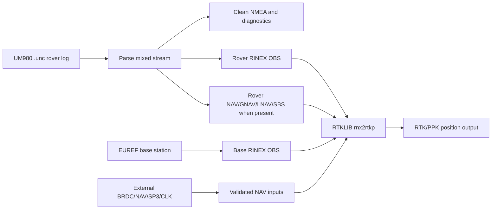

# UM980 RTKLIB Pipeline

Python tools for Unicore UM980 mixed serial logs and RTKLIB post-processing.

The CLI command is `um980-ppk`. It can generate UM980 logging scripts, analyse
mixed logs, extract clean NMEA and solution tracks, create observation CSV files,
write RINEX 3 observation scaffolds, resolve NAV inputs, and assemble safe
`rnx2rtkp` invocations.

This project intentionally does not depend on RTKLIB `convbin` for rover UM980
`.unc` conversion. Many RTKLIB builds do not include Unicore support, `convbin`
does not reliably handle UM980 ASCII mixed captures, and raw observations must
not be treated as navigation data.

## Why This Tool Exists

UM980 field logs are usually mixed serial captures: NMEA solution sentences,
Unicore ASCII/binary records, raw observations, and sometimes ephemeris records
are interleaved in one `.unc` stream. RTKLIB needs clean RINEX observation files,
valid navigation data, base-station observations, and platform-correct paths.
This tool performs that glue work explicitly so failed assumptions are visible:
unsupported UM980 records are reported, receiver ephemerides are written only
when real records can be converted, empty NAV placeholders are rejected, and
missing EUREF base products warn before fallback.



Typical workflow:

1. Generate a receiver init script for the UM980 logging mode you want.
2. Capture the rover `.unc` stream in the field.
3. Run `um980-ppk pipeline` to extract diagnostics and write rover RINEX OBS.
4. Use generated receiver NAV/GNAV/LNAV/SBS files when available, and add
   external NAV data when the rover log does not contain every needed system;
   either download EUREF base data or pass local base OBS files.
5. Let the pipeline run `rnx2rtkp`, or use `postprocess` when the RINEX inputs
   are prepared separately.

## Installation

The Python package requires Python 3.11 or newer. RTKLIB-ex tools are separate
binaries; install them under `~/RTKLIB-ex-bin/bin/`, pass `--rtklib-dir`, or keep
them on `PATH`.

For a system-wide installation, run from the repository checkout using the
system Python. On Linux this is typically:

```bash
sudo -H python3 -m pip install .
um980-ppk --help
```

On platforms without `sudo`, use the equivalent administrator/root shell, or the
active Python environment if it is already the system environment:

```bash
python3 -m pip install .
um980-ppk --help
```

Only install into a system-managed Python when that matches the machine's Python
packaging policy. To include optional YAML config support:

```bash
python3 -m pip install '.[config]'
```

For development and testing without a system-wide install, use a virtual
environment and an editable install:

```bash
python3 -m venv .venv
. .venv/bin/activate
python -m pip install -e '.[config,test]'
um980-ppk --help
pytest -q
```

For quick testing directly from a checkout without installing the package at all,
invoke the module with `PYTHONPATH=src`:

```bash
PYTHONPATH=src python -m um980_rtklib_pipeline.cli --help
PYTHONPATH=src python -m um980_rtklib_pipeline.cli rinex rover.unc --obs-csv -v
PYTHONPATH=src pytest -q
```

Pass `-v`/`--verbose` when processing real captures. Verbose mode reports
long-running parsing, solution extraction, observation decoding, RINEX writing,
base download, Hatanaka conversion, and RTKLIB execution stages so the CLI does
not sit silently while large `.unc` files are being processed. Pass `-d` or
`--debug` when debugging external tools; it includes verbose progress and logs
the exact shell-quoted `crx2rnx` and `rnx2rtkp` commands, wrapper path, and
stdout/stderr log paths before execution.

See [COLLECT-DATA.md](COLLECT-DATA.md) for the private capture plan needed to
finish parser coverage and serial-capacity calibration.

## Examples

Generate a receiver command script:

```bash
um980-ppk init generate \
  --port COM1 \
  --baud 230400 \
  --mode rover \
  --raw-format obsvmb \
  --raw-hz 2 \
  --nmea-preset solution-20hz \
  --solution-hz 20 \
  --debug-ascii-ephemeris \
  --ppp e6-has \
  --include-tropinfo \
  --ion gps,bds,bd3,gal \
  --save-config \
  --out um980-init.cmd \
  -v
```

For binary ephemeris captures, use the explicit binary command family:

```bash
um980-ppk init generate \
  --raw-format obsvmcmpb \
  --raw-hz 2 \
  --ephemeris every=300 \
  --ephemeris-format binary \
  --out um980-binary-ephem.cmd
```

For an RTKLIB-ex `convbin -r unicore` trial, use a binary-only capture profile:
`OBSVMB`, binary ephemeris commands, and no NMEA or ASCII diagnostic messages on
the captured stream. See [UM980 Logging](docs/um980_logging.md#convbin-trial-capture)
for the UM890/UM980 init command and cleanup rules. `OBSVMCMPB` is not the first
convbin test path because the checked RTKLIB-ex Unicore decoder does not
dispatch compressed observation message ID 138.

When PPP is enabled, the init generator emits `CONFIG PPP TIMEOUT 120` and
`CONFIG PPP CONVERGE 15 30` unless overridden with `--ppp-timeout` and
`--ppp-converge horizontal,vertical`. `--include-tropinfo` is accepted only with
PPP enabled and emits one selected format as `ONCE` and `ONCHANGED`: `TROPINFOA`
by default, or `TROPINFOB` with `--diagnostic-format binary`. Ionosphere logging
can be enabled independently with `--ion gps,bds,bd3,gal` or `--include-ion`;
the generator emits the selected `...IONA`/`...IONB` command as `ONCHANGED`.
Add `--ion-period 300` to also repeat those messages periodically so sliced logs
still contain ionosphere parameters even if no receiver `ONCHANGED` event occurs
during the slice.

Extract solution products and observations:

```bash
um980-ppk extract rover.unc -v --analysis-json --obs-csv --solution all
```

Create rover RINEX observation output:

```bash
um980-ppk rinex rover.unc --obs-csv -v
```

Use `--rinex-compat convbin` when standalone `rinex` output should follow
RTKLIB `convbin` conventions more strictly. The integrated `pipeline` command
uses this RTKLIB-compatible profile by default. Both profiles suppress
non-standard unknown-system `U` satellites because RTKLIB rejects `U` in RINEX 3
OBS headers. The convbin profile additionally uses convbin-style observation
ordering and drops unsafe records such as observations logged before the
receiver reports a fine time solution.

Download base data URLs for a rover time window without fetching:

```bash
um980-ppk download-base rover.unc \
  --station CPAR \
  --rtklib-dir ~/RTKLIB-ex-bin/bin \
  --crx2rnx ./crx2rnx.exe \
  --offline -v
```

Run post-processing with explicit inputs:

```bash
um980-ppk postprocess rover.unc \
  --rover-obs rover.direct.obs \
  --base-obs CPAR.obs \
  --nav-file BRDC00WRD_R_20261380000_01D_MN.rnx \
  --base-station CPAR \
  --rnx2rtkp rnx2rtkp \
  --rtkconf rtkpost-normal.conf
```

`--rtkconf` is optional. When it is omitted, `postprocess` and `pipeline`
generate a conservative `rnx2rtkp` command-line profile instead of inventing a
missing config file: kinematic mode, L1/L2/L5, GPS+GLONASS+Galileo+BeiDou+QZSS,
10 degree elevation mask, and combined forward/backward post-processing. Adjust
that profile with `--rtk-pos-mode`, `--rtk-frequency`, `--navsys`,
`--rtk-navsys`, `--rtk-elevation-mask`, `--rtk-soltype`, `--rtk-ar-mode`, or
repeat `--rnx2rtkp-option=TOKEN` for raw RTKLIB options. Use `--rtkconf` when
you want a full RTKLIB-EX config such as one distributed with RTKLIB-EX.
`--output-format pos` uses the conventional `.pos` suffix for RTKLIB's default
latitude/longitude/height content, which RTKLIB config files call
`out-solformat=llh`. `--output-format nmea` passes RTKLIB's `-n` option,
equivalent to setting `out-solformat=nmea`; it does not merely rename a `.pos`
file to `.nmea`. If an RTKLIB build writes a successful run to stdout instead
of honoring `-o`, the pipeline saves that captured stdout as the requested
output file; if no output exists anywhere, the run fails with the command and
log paths.
For solution-quality debugging, add `--rtklib-trace-level 4
--rtklib-stat-level 2`; these pass `rnx2rtkp -x 4 -y 2` and work with or
without `--rtkconf`.
For explicit diagnostic two-pass satellite QC, use `--auto-sat-qc` with a
baseline config such as `um980-autoqc-baseline.conf`. This runs pass 1 with
RTKLIB `.stat` residual output, writes `<stem>.autoqc.derived.conf` plus
Markdown/JSON reports, then runs pass 2 with the derived config. It is
intentionally opt-in and never runs by default.
The repository includes `um980.conf`, an RTKLIB-ex/demo5 profile tuned for
UM980 multi-constellation, multi-frequency PPK. It enables GPS, GLONASS,
Galileo, and BeiDou with L1/L2/L5/L6 processing, dynamics, interpolation, and
fix-and-hold ambiguity handling. Prefer `--rtkconf um980.conf` for serious
UM980 post-processing; the generated command-line profile is mainly a portable
fallback.

Run the integrated pipeline with EUREF base download and RTKLIB execution:

```bash
um980-ppk pipeline rover.unc \
  --download-base \
  --station CPAR \
  --base-resolution high \
  --base-rinex-version 3 \
  --nav-file BRDC00WRD_R_20261380000_01D_MN.rnx \
  --rtkconf um980.conf \
  --run-rtklib
```

Two-pass satellite QC example:

```bash
um980-ppk pipeline rover.unc \
  --download-base \
  --station CPAR \
  --base-resolution high \
  --rtkconf um980-autoqc-baseline.conf \
  --auto-sat-qc \
  --run-rtklib
```

Use `--base-resolution low` for hourly 30 s EUREF data or
`--base-resolution high` for 15 minute 1 s high-rate files. If high-rate data is
requested but unavailable, the command warns with the failed URLs and falls back
to low-rate data unless `--no-base-fallback` is set. `--base-rinex-version 2`
selects compact RINEX 2/Hatanaka EUREF names, including BEV low-rate
`.YYd.gz` names and BKG high-rate `.YYd.Z` names; `auto` plans RINEX 3 first,
then RINEX 2 alternatives.

Base downloads are cache-first. The downloader reuses existing archives,
decompressed files, or already converted `.rnx`/`.YYo` products in `--base-dir`
or `--cache-dir`, and downloads only missing planned products. Add
`--force-download` when you intentionally want to refresh the source archives.
When several base RINEX files are retained, the pipeline stages exactly those
files into `<basename>.rtklib-base/` and passes one wildcard argument to
`rnx2rtkp`. The wildcard is passed directly to RTKLIB, not expanded by the
shell, because RTKLIB expects the base station observation input as the second
positional argument. On Cygwin, the directory part is converted to a Windows
path while the `*` itself is preserved, because `cygpath` maps literal wildcard
characters to private-use Unicode code points.

Base download planning uses the recorded rover observation time span and
requests every hourly or 15 minute product that overlaps or touches that span.
`--time-margin SECONDS` deliberately expands the span; the default is `0` so
adjacent non-overlapping products are not fetched or passed to RTKLIB.

`postprocess` passes a base reference position to RTKLIB when one is available.
Use `--base-ecef X Y Z` or `--base-llh LAT LON HEIGHT` for an explicit
position. Otherwise `--base-station CPAR` resolves current EPN/EUREF ETRF2000
ECEF coordinates and emits `-r X Y Z`; auto mode falls back to the base RINEX
`APPROX POSITION XYZ` header.

On Cygwin, Windows RTKLIB tools usually need Windows-style paths for input
files even though the Python pipeline sees Unix paths. `postprocess`
auto-detects Cygwin plus Windows `.exe` or PE binaries, including PE binaries
without an `.exe` suffix, and passes Windows paths to RTKLIB while still
validating local files with Unix paths:

```bash
um980-ppk postprocess rover.unc \
  --rover-obs /cygdrive/c/ppk/rover.direct.obs \
  --base-obs /cygdrive/c/ppk/CPAR.obs \
  --nav-file /cygdrive/c/ppk/BRDC00WRD_R_20261400000_01D_MN.rnx \
  --rtklib-dir /cygdrive/c/RTKLIB/bin \
  --rnx2rtkp rnx2rtkp.exe \
  --rtkconf /cygdrive/c/ppk/rtkpost-normal.conf
```

Use `--rtklib-path-style unix` for a native Cygwin/Linux RTKLIB build, or
`--rtklib-path-style windows` to force Windows argument paths.

RTKLIB tools are resolved in this order:

1. explicit tool path from `--rnx2rtkp`;
2. `--rtklib-dir` plus the tool name;
3. user-local `~/RTKLIB-ex-bin/bin/`;
4. repo-local `build-tools/RTKLIB-ex-bin/bin/`;
5. system `PATH`.

For Hatanaka base observations, `crx2rnx` is resolved separately from
`--crx2rnx`, `--rtklib-dir`, the current directory, user-local/repo-local
RTKLIB-ex installs, and `PATH`. Automatic discovery accepts both `crx2rnx` and
`crx2rnx.exe`.

The `build-tools/RTKLIB-ex-bin/` directory is intentionally ignored by git. It
is a convenient local install location for manually built RTKLIB-ex binaries.
On Android/Termux shared storage, files in this directory may not be directly
executable; the pipeline mirrors the selected local tool into Termux-private
temporary storage before launching it. This mirroring is Termux-only; Cygwin
keeps the selected RTKLIB executable path and never rewrites it to a Termux
`/data/data/...` location.

For Android/Termux, `~/RTKLIB-ex-bin/bin/` is preferred because binaries stored
under `$HOME` can be executed directly.

## Current Limitations

- `OBSVMA` ASCII observation decoding supports a conservative token-based subset.
- `OBSVMB` and `OBSVMCMPB` binary observation payloads are decoded in Python.
- RINEX output from real UM980 observation payloads decodes the documented
  tracking-status constellation and signal bits for common GPS, GLONASS,
  Galileo, BDS, QZSS, SBAS, and IRNSS observations. Unknown signal types are
  still warned and written with conservative fallback codes.
- Rover ASCII ephemeris extraction writes non-empty `.nav`, `.gnav`, `.lnav`,
  `.cnav`, and `.sbs` files for convertible `GPSEPHA`, `GLOEPHA`, `GALEPHA`,
  `BDSEPHA`, and RTKLIB-shaped SBAS message records. Missing systems,
  malformed records, and unsupported BDS-3/QZSS/binary ephemeris records are
  logged and included in analysis
  JSON instead of producing placeholder files.
- `--debug-ascii-ephemeris` adds `GPSEPHA`, `GLOEPHA`, `GALEPHA`, `BDSEPHA`,
  `BD3EPHA`, and `QZSSEPHA` every 300 seconds. The generated script warns that
  this creates large debug logs and includes the ephemeris contribution in the
  serial-line utilisation estimate. The estimate accounts for one ephemeris
  record per expected satellite, not just one line per constellation.
- `--ephemeris-format binary` emits `GPSEPHB`, `GLOEPHB`, `GALEPHB`,
  `BDSEPHB`, `BD3EPHB`, and `QZSSEPHB`. The shorter names without `B` are not
  valid UM980 commands and are expected to be rejected by the receiver.
- Network download code is explicit and opt-in. Offline mode prints planned URLs.
- `pipeline` executes RTKLIB when `--run-rtklib`, `--rtkconf`, usable NAV data
  from receiver or explicit inputs, and base observations from `--base-obs` or
  `--download-base` are supplied. Without those inputs it stops after
  extraction/RINEX generation and logs a warning.
- RTKLIB commands are assembled with argument lists, and generated shell wrappers
  are for reproducibility only.
